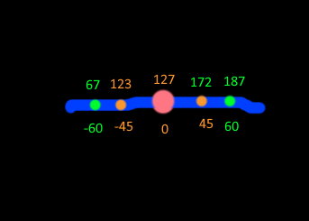

# VPad Tester & Configurator

## Dev Miscellany:

### Building:

lua player plus' builder is included in .\lpp - read the readme in there, or just run zbuild.bat

* i've modified build.bat to zbuild.bat because i'm lazy
	* use the original if you want to change the name/id
	* you'll have to mess with directories
* [vpk editor](https://qberty.com/ps-vita-vpk-editor/) is quite useful for automatically reducing bit depth
* this is how i visualise stick range

