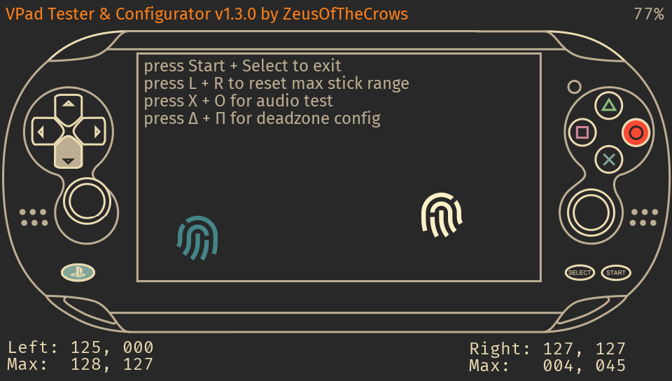

# VPad Tester & Configurator

PSVita hardware tester, with support for configuring Rinnegatamante's AnalogsEnhancer plugin.

### Features:

* highlight currently pressed buttons
* visual feedback & absolute numbers of analogue stick input
* visual feedback of touchscreen/touchpad, including multitouch
* max range of analogue stick input (useful for adjusting deadzones)
* reading (and eventually writing) the config file for AnalogsEnhancer
* stereo audio tester

this app is an extended version of a utility created by Smoke5, converted to Lua by Keinta15

---

## Credits to:

- Original VitaTester [SMOKE5](https://github.com/SMOKE5) for [VitaTester](https://github.com/SMOKE5/VitaTester)
- Conversion to Lua [Keinta15](https://github.com/Keinta15/) for [Lua Vita Tester](https://github.com/Keinta15/Lua-Vita-Tester)

## Extra Credits

- [Rinnegatamante](https://github.com/Rinnegatamante) for [lpp-vita](https://github.com/Rinnegatamante/lpp-vita)
- [xerpi](https://github.com/xerpi) for [vita2dlib](https://github.com/xerpi/vita2dlib)
- [tokyoship](https://commons.wikimedia.org/wiki/User:Tokyoship) for the [vita wireframe](https://commons.wikimedia.org/wiki/File:PlayStation_Vita_Layout.svg) [CC BY-SA 3.0](https://creativecommons.org/licenses/by-sa/3.0)
- [remix icons](https://remixicon.com/) for the fingerprint icon, and the cog + spanner on the logo
- [pngquant](https://pngquant.org/) for smaller images
- [Ruben_Wolfe451](https://twitter.com/Ruben_Wolfe451)
